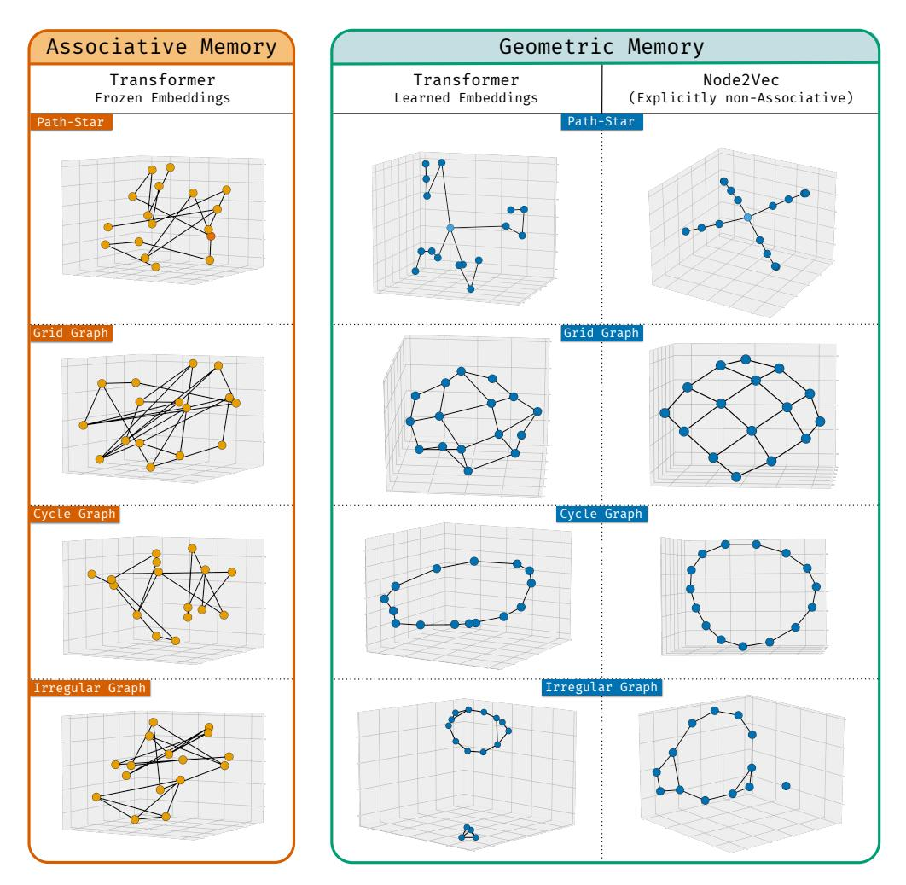

# rediscovery

A framework-free, CPU-only Rust replication of arXiv 2510.26745v2 ("Deep
sequence models tend to memorize geometrically; it is unclear why" — Noroozizadeh,
Nagarajan, Rosenfeld, Kumar): the Node2Vec spectral-bias dynamics of §4/Appendix F,
the §B.2.2 TinyNN associative-vs-geometric competition of §3, and the measured
findings both produced. Every gradient is hand-derived and pinned by central
finite differences; every run is seeded and bit-reproducible; f64 throughout;
no autodiff framework.



*Figure 1 of [arXiv 2510.26745v2](https://arxiv.org/abs/2510.26745): the same
graphs memorized as an associative lookup over arbitrary embeddings (left) vs.
the geometric embeddings a Transformer learns (middle) vs. the cleaner geometry
of a Node2Vec model (right). The right two columns are what this project
replicates.*

## The headline finding

Under a spectral-alignment criterion calibrated so the paper's own reference
geometries pass (Laplacian Fiedler eigenvectors 1.0, Node2Vec 0.98–1.00;
threshold 0.75), **the TinyNN's spectral geometry is decided by its hidden
layer's initialization, not by its trainability and not by the optimizer**:
with W(0) = I every learnable run crosses the criterion within 7–35 full-batch
steps — even with W training freely — while with W(0) ~ N(0, 1/m) no run
crosses it in 20,000 steps at any relative weight rate, nor under §B.3's
AdamW-with-schedule; those runs memorize the edges instead. §B.2.2 does not
state the paper's initializer. The two-run demonstration:

```sh
cargo run --release --example w_init_flip
```

An independent single-file numpy reimplementation of the same flip is
`examples/w_init_flip.py` (the Rust crate is the pinned reference; the Python
file is verified against it at the instrument and phenomenon levels, as its
docstring states). The full 64-run sweep and the 24-run §B.3 arm are
`examples/tier2_transition.rs`. All measured findings — including where the
implementation reproduces the paper's figures but not their captions, and
where its claims narrow — are recorded under Findings in
[`CHANGELOG.md`](CHANGELOG.md), with the run-level records on the repository's
issues.

## What is here

| module | contents |
|---|---|
| `graph` | the paper's tiny topologies — path-star, grid, cycle, irregular, tree-star, complete — over dense nalgebra adjacency |
| `spectral` | D⁻¹A, the random-walk Laplacian (I − D⁻¹A) + (I − D⁻¹A)ᵀ, and `Spectrum`: the eigendecomposition of −L with deterministic ordering, sign convention, and degenerate-group detection |
| `node2vec` | Tier 1 — the Eq. 1 objective, P = row_softmax(VVᵀ), Lemma 6's step ΔV = ηCV, the weight-untied variant, and the Figure-9 instrumentation |
| `tinynn` | Tier 2 — Z = E W Eᵀ with frozen and learnable regimes, the calibrated `fiedler_alignment` criterion, the W-initialization and relative-rate knobs, and a hand-rolled decoupled AdamW with linear warmup and cosine decay |
| `numerics`, `output` | softmax, log-sum-exp, degree-weighted cross-entropy, seeded ChaCha20 Gaussian draws, matrix-CSV output |
| `subsystems::runner` | the async lifecycle core: a `Runner` owning a `TaskTracker` + `CancellationToken` with cancel → close → drain shutdown; experiments run as cancellation-aware jobs |

Experiments are `examples/` binaries writing per-step CSVs into the gitignored
`output/`: `tier1_fig9` (the Figure-9 panels), `tier2_tinynn` (the
associative-vs-geometric sweeps), `tier2_transition` (the initializer and
optimizer experiments), `w_init_flip` (the two-run demonstration; stdout only).

The design record is
[`docs/2510.26745v2-poc-analysis.md`](docs/2510.26745v2-poc-analysis.md):
conversion validation against the source PDF, the claims inventory, eight
catalogued errata in the paper's own text, and the knob decisions D1–D10 the
paper leaves unspecified.

## Tests

```sh
cargo nextest run
```

(or `cargo test`). The suite's pins are falsified as a discipline: each
regression test has been shown to go red under the perturbation it claims to
catch, with the measured value in its failure message. Doc comments carry no
code examples by policy (`doctest = false`); compile-checked usage lives in
`examples/`.

## License

MIT — see [LICENSE](LICENSE). Figure 1 above is reproduced from the paper and
remains its authors' work, shown here with attribution for commentary.
